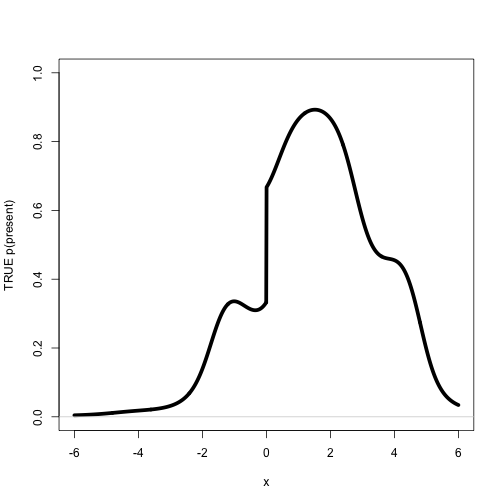
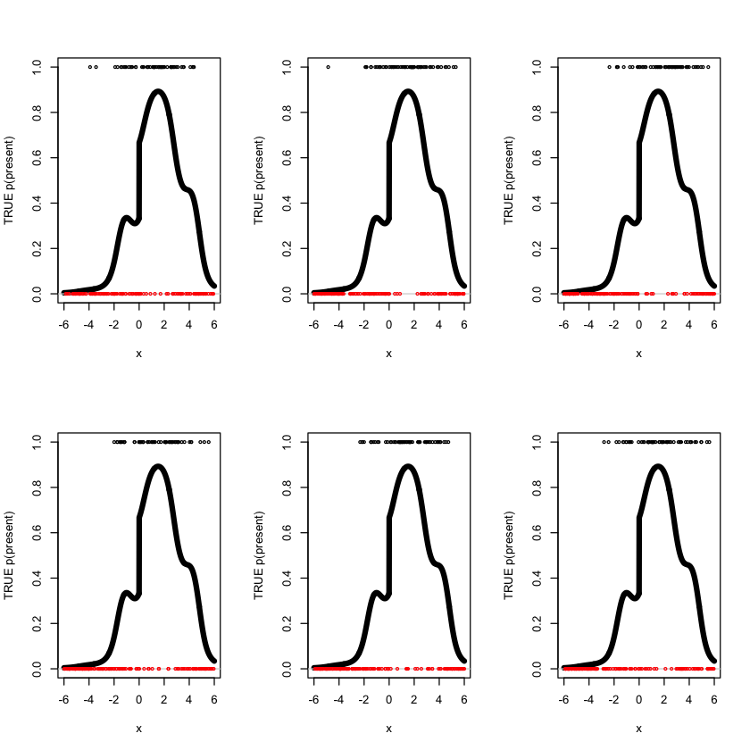
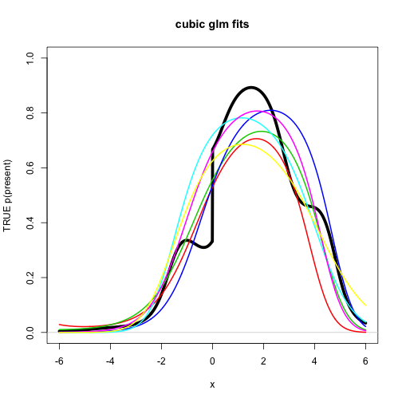
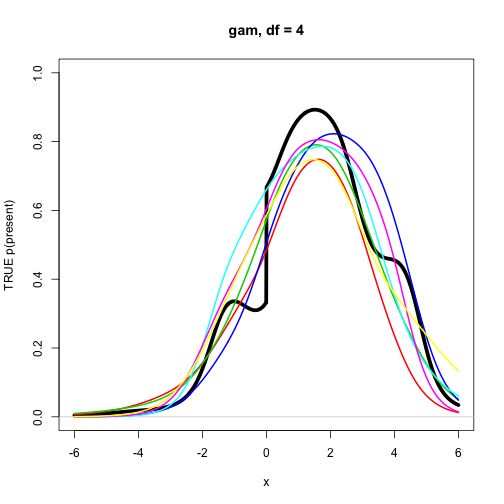
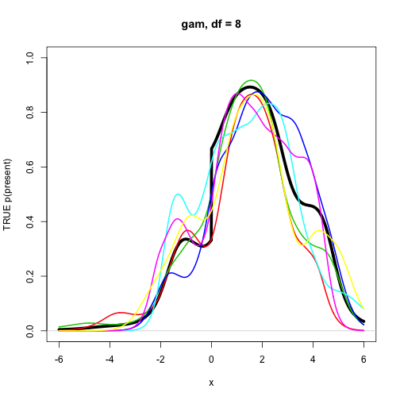
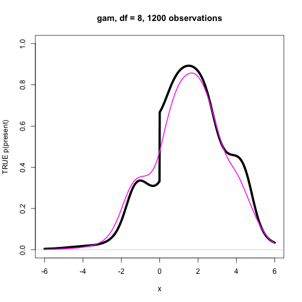
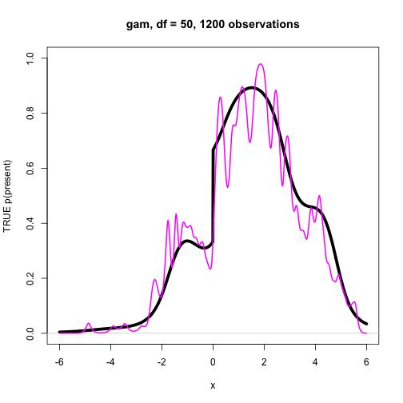
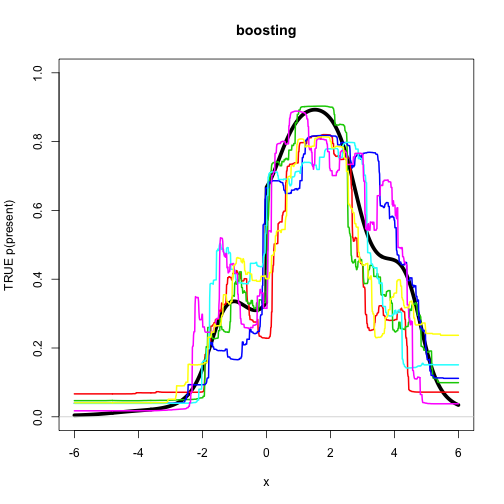
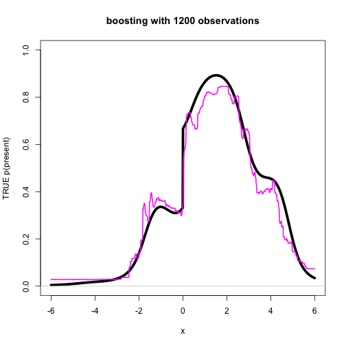

David J. Harris

davharris@ucdavis.edu

Species Distribution Modeling tutorial, part 1

Version 0.1.1

# Part 1: Model types and overfitting 

## How to use this part of the tutorial

Part 1 is just a quick tour of some different model types you could fit on a toy data set, and is mainly useful for the figures and main text.  I've hidden most of the code in the .html file, since I don't think it's useful.  But you can see it in the .Rmd file along with comments I've written, if you want to look it up.

Part 2 will go into some more detail on a specific method, called boosting.


## The Truth

With that out of the way, I'm going to play God for a moment, and invent a species whose probability of occurring at a site given its levelof environmental factor *x* is exactly defined by the following function:


```r
f = function(x) {
    pt(x/2 + sin(x)^2 - x^2/5 + ifelse(x > 0, 0.5, -0.5), df = 2)
}
```


The function looks like this:

 


Throughout, I'll use thick black lines to denote this TRUTH.  All the models below will be trying to approximate this function, but without actually knowing what it is.  All the models get to see is a few random samples from it.

## The samples

As noted above, in the real world, we won't actually know what the TRUTH is, so we have to rely on samples.  Here are six examples of random samples that could be drawn from the TRUTH.  Black dots at $y = 1$ are for presences; red dots at $y = 0$ are for absences.

 


Remember, the goal is to reconstruct the black curve using only the samples we happen to observe.

## Models

Let's start by fitting some generalized linear models (GLMs) to the samples.  GLMs are the bread-and-butter of ecology, since they can fit models to lots of different kinds of data, including counts, binary yes/no data, and various kinds of continuous measurements.  As we'll see, however, they tend not to be flexible enough to fit good curves to species distirbutions.

The syntax for these models in `R` usually looks like like

`glm.model = glm(y ~ poly(x, 3), family = binomial, data = data)`

where `poly(x, 3)` indicates that we use a third-order polynomial (a cubic).

 


Note that the glms don't really capture the shape of the curve, regardless of which set of 200 observations we feed to the model. There seem to be some systematic biases, with all six models missing the full height of the main peak and then remaining too high on both ends as it trails off. The glm simply can't capture what's going on.

Let's see if something more flexible like a generalized additive model (GAM) does better. For simplicity's sake, I used the `gam` function from the `gam` package, although the `mgcv` package is probably better for most purposes.

GAMs drop the assumption that we know the functional form of the curve (e.g. that it's a polynomial), but still assume that the curve doesn't jump around too much.  Formally, that usually involves constraints or penalties on the second derivative of the function.

In `R`, the syntax for GAMs is almost identical as for GLMs:

`glm.model = glm(y ~ s(x, df = 4), family = binomial, data = data)`

Here, `s` stands for "smooth", and `df = 4` is a typical value describing how curvy we want to let it be (i.e. how to manage the tradeoffs between making the model flexible enough to fit the data but not so flexible that it does something stupid).

 


These models look *somewhat* better than the glms, since they get closer to the highest peak and hug the sides a bit more on their way down.  But they're still missing the full shape of the distribution.

So we might try increasing the number of degrees of freedom we give it, allowing it to make curvier shapes.  Here are the results with `df = 8`:

 


That seems to look better in most cases.  In particular, it no longer looks like all six models are consistently wrong in the same ways, which makes it seem like the model is finally flexible enough to capture what's going on.

On the other hand, the gam models do show some signs of overfitting, finding extra curves in the data that aren't really there in the TRUE black line.

The `mgcv` version of `gam` has some features for automatically selecting how many degrees of freedom to give to each smoothing term, but that's beyond the scope of this little tutorial.

One thing that's worth noting is that, as you add more data, you can fit more complex models without overfitting as much.  The next graph shows what happens if you use `df = 8` on one big data set with 1200 observations, instead of on six little ones with 200 each:

 


Note that it actually gets most of the shape right, and doesn't have a lot of superfluous wiggles.  This is pretty clearly the best fit we've seen so far, although it's sort of cheating to use six times as muchd data as the competition.

Even with a lot of data, it's still possible to overfit. Here's what happens if you give the model 50 degrees of freedom:

 


Practically every outlier gets its own wiggle in the curve.  That's a bad sign, since it overshoots the TRUTH a dozen or so times, often by quite a bit

Let's conclude with a boosting example.  Boosting works by going through many iterations of model fitting, where each iteration's job is to clean up any mistakes from the previous iterations. Partly for historical reasons, it's most common to have each iteration be a "tree" (like a flowchart or dichotomous key), but people have used all sorts of models as "base learners" for boosting, including GAMs.

The trick with boosting is knowing when to stop adding more iterations, since the model gets more and more complex (and thus more likely to overfit) the longer you go.  I'll talk about that more in part 2, along with more details about how to use a good boosting package in `R`.

 


These curves are ugly, since they have lots of small jumps, but they do tend to hug the TRUE curve pretty closely, even with only 200 observations to work from.

The curve looks far better if we let it see all 1200 observations:

 


In part 2, we'll see a bit more about how to actually implement this kind of model.


# Part 2: outline


At the end of Part 1, the code I used to fit the model with all 1200 observations looked like this:


```r
gbm.model = gbm(
  y ~ x, 
  distribution = "bernoulli", 
  data = long.data,
  n.trees = 10000, 
  verbose = FALSE, 
  interaction.depth = 3,
  cv.folds = 5, 
  shrinkage = .0005
)
```


That's a lot to unpack, so I'm just briefly going to go over what each of these lines does.

* `gbm.model = gbm(`
  * This line calls the `gbm` function and saves the results in an object called `gbm.model`.
* y ~ x, 
  * This is an `R` formula.  It says that `y` depends on `x`.  In a model with more than one predictor variable, you could say `y ~ x + z + a + b + c` or, more succinctly, just say `y ~ .` to have `gbm` include all the variables in the `data` argument.
* `distribution = "bernoulli"`
  * The Bernoulli distribution is a coin-flip distribution.  This tells `gbm` that we're dealing with presence-absence data, as opposed to counts or continuous variables.
* `data = long.data`
  * this is a data.frame containing the predictor variables (just `x`, in this case)
* `n.trees`
  * This is the maximum number of trees to include in the boosted model.  10000 is a good default.


<a rel="license" href="http://creativecommons.org/licenses/by/3.0/deed.en_US"></a><br /><span xmlns:dct="http://purl.org/dc/terms/" href="http://purl.org/dc/dcmitype/Text" property="dct:title" rel="dct:type">SDM tutorial</span> by <a xmlns:cc="http://creativecommons.org/ns#" href="https://github.com/davharris/SDM-tutorial" property="cc:attributionName" rel="cc:attributionURL">David J. Harris</a> is licensed under a <a rel="license" href="http://creativecommons.org/licenses/by/3.0/deed.en_US">Creative Commons Attribution 3.0 Unported License</a>.
